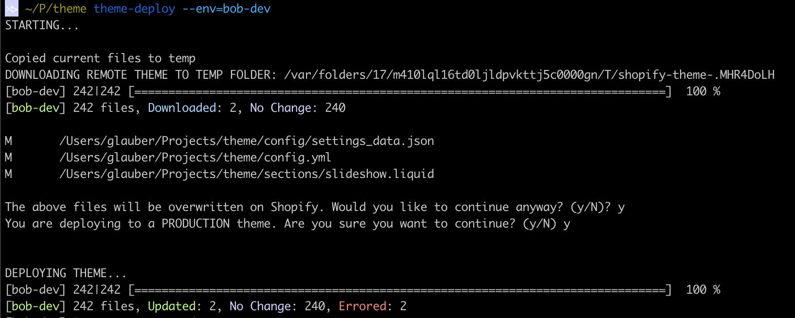

# theme-deploy

- downloads the remote theme into a temp folder
- runs git diff of the current folder against the temp folder downloaded
- shows differences if exists
- asks if you really want to overwrite the changes
- asks if you really want to deploy the changes

## Requirements
1. git cli
2. [Shopify themekit](https://shopify.dev/tools/theme-kit/getting-started)

## Installing
`curl -o /usr/local/bin/theme-deploy -k https://raw.githubusercontent.com/glaubermagal/theme-deploy/main/theme-deploy.sh && chmod +x /usr/local/bin/theme-deploy`

## Running
`theme-deploy [themekit arguments]`

